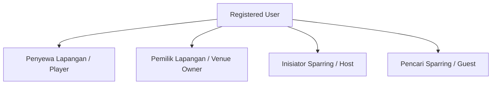
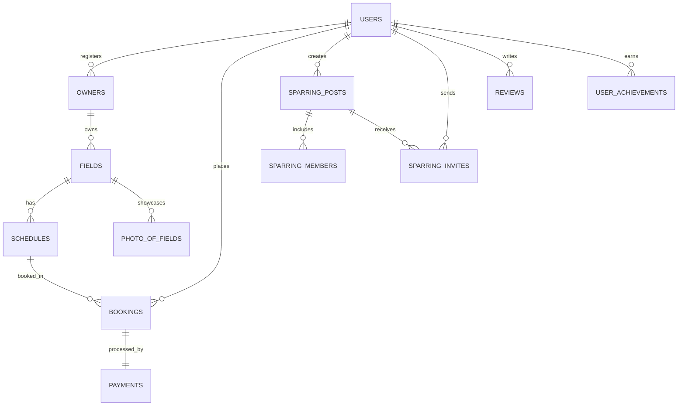
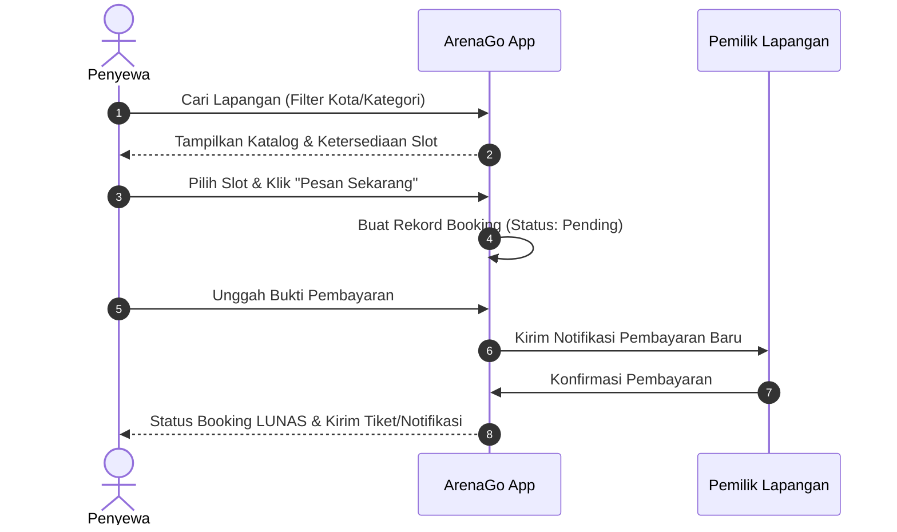
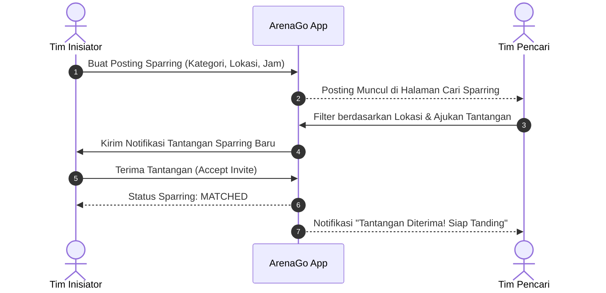

# Product Requirement Document (PRD) — ArenaGo v2

## 1. Executive Summary & Product Vision

**ArenaGo v2** adalah platform ekosistem olahraga terpadu (*All-in-One Sports Ecosystem*) yang menjembatani pemilik lapangan olahraga (*venue owners*), penyewa lapangan (*renters/players*), serta komunitas pencari & pembuat aktivitas sparring (*matchmaking*).

### Vision Statement
Menjadi platform utama bagi komunitas olahraga untuk menemukan lapangan, mengelola slot jadwal, melakukan pembayaran online/transparan, menemukan lawan sparring berdasarkan lokasi & cabang olahraga, serta melacak prestasi & aktivitas olahraga secara terintegrasi.

---

## 2. User Roles & Account Model

ArenaGo v2 mengadopsi model **Flexible Dual-Role**. Setiap pengguna yang mendaftar secara otomatis memiliki akun tunggal yang dapat menjalankan multiple fungsi tanpa perlu membuat akun terpisah:

1. **User / Penyewa (Renter)**: Pengguna umum yang mencari lapangan, memesan slot, melakukan pembayaran, memberi ulasan, dan mengumpulkan *achievements*.
2. **Pemilik Lapangan (Venue Owner)**: User yang mendaftarkan tempat usahanya untuk memublikasikan lapangan, mengatur slot jam operasional, dan menerima pemesanan.
3. **Inisiator Sparring (Sparring Host)**: User/Tim yang membuat postingan ajakan sparring di lokasi & jam tertentu.
4. **Pencari Sparring (Sparring Seeker/Challenger)**: User/Tim yang mencari postingan sparring berdasarkan lokasi, lalu mengajukan tantangan (*sparring invite*).

---

## 3. Epics & Functional Requirements

### Epic 1: Authentication & Flexible Profile Management
- **REQ-1.1**: Pendaftaran akun menggunakan Nama, Email, Password, & Nomor WhatsApp.
- **REQ-1.2**: User dapat melengkapi profil (Foto, Lokasi/Kota, Cabang Olahraga Favorit).
- **REQ-1.3**: Pendaftaran sebagai Pemilik Lapangan (Form Pendaftaran Usaha: Nama Usaha, Kota, Foto Usaha, Alamat Lengkap, Rekening Bank).

---

### Epic 2: Venue & Field Management (Pihak Owner)
- **REQ-2.1**: Manajemen Lapangan (Tambah, Edit, Hapus Lapangan, Kategori Olahraga: Futsal, Badminton, Basket, Mini Soccer, dll.).
- **REQ-2.2**: Galeri Foto Lapangan.
- **REQ-2.3**: Pengaturan Jam Operasional & Tarif (Harga per jam, Slot waktu per hari/minggu).
- **REQ-2.4**: Dashboard Pemilik (Melihat pesanan masuk, status pembayaran, & konfirmasi jadwal).

---

### Epic 3: Search, Booking & Slot Scheduling (Pihak Penyewa)
- **REQ-3.1**: Pencarian Lapangan berdasarkan Nama, Kota/Lokasi, Kategori Olahraga, dan Rentang Harga.
- **REQ-3.2**: Detail Lapangan (Deskripsi, Fasilitas, Foto, Lokasi, Ulasan & Rating, serta Jadwal Slot Ketersediaan Real-Time).
- **REQ-3.3**: Form Pemesanan Slot (Pilih Tanggal, Slot Jam, Rincian Total Harga).
- **REQ-3.4**: Manajemen Pesanan Saya (Melihat status pesanan: Pending, Paid, Completed, Cancelled).

---

### Epic 4: Payment System
- **REQ-4.1**: Halaman Instruksi Pembayaran (Transfer Bank / e-Wallet / Simulasi Payment Gateway).
- **REQ-4.2**: Unggah Bukti Pembayaran & Konfirmasi Status Pembayaran (Otomatis/Manual).
- **REQ-4.3**: Riwayat Transaksi Pembayaran.

---

### Epic 5: Sparring & Matchmaking System (Sistem Sparring)
- **REQ-5.1 (Buat Post Sparring)**: User dapat membuat jadwal & postingan sparring (*Inisiator*):
  - Judul, Cabang Olahraga, Lokasi/Kota, Tanggal & Jam, Nama Tim/Komunitas, Pilihan Lapangan (opsional), Estimasi Biaya/Patungan, Kontak.
- **REQ-5.2 (Cari Sparring & Filter Lokasi)**: User (*Pencari Sparring*) dapat mencari tim sparring berdasarkan:
  - Lokasi/Kota.
  - Kategori Olahraga (Futsal, Badminton, Basket, dll.).
  - Tanggal & Status (Open / Matched).
- **REQ-5.3 (Tantang / Ajukan Sparring)**: User dapat mengajukan tantangan sparring (*Sparring Invite*) ke tim lain dengan menyertakan nama tim tantangan & pesan.
- **REQ-5.4 (Kelola Undangan Sparring)**: Inisiator menerima notifikasi tantangan dan dapat **Menerima (Accept)** atau **Menolak (Reject)** tantangan sparring.
- **REQ-5.5 (Gabung Anggota Tim)**: User dapat bergabung sebagai anggota individu ke dalam tim sparring (*Sparring Members*).

---

### Epic 6: Ulasan (Reviews) & Lapangan Favorit
- **REQ-6.1**: User yang telah selesai menyewa lapangan dapat memberikan **Rating (1-5 Bintang)** dan **Ulasan Teks**.
- **REQ-6.2**: Menampilkan Rata-rata Rating dan daftar ulasan di halaman detail lapangan.
- **REQ-6.3**: Simpan ke Lapangan Favorit (Bookmark).

---

### Epic 7: Gamifikasi (Achievements & Riwayat Aktivitas)
- **REQ-7.1**: **Achievements / Badges System**:
  - Penghargaan otomatis berdasarkan milestone (contoh: *"First Booking"*, *"5 Match Sparring Played"*, *"Venue Master"*).
- **REQ-7.2**: **Activity History**:
  - Log riwayat semua aktivitas olahraga user (Pemesanan lapangan, Sparring yang diikuti, Pencapaian yang didapat).

---

### Epic 8: Notifications System
- **REQ-8.1**: Notifikasi dalam aplikasi (*In-App Notifications*) untuk:
  - Pembayaran diterima/dikonfirmasi.
  - Tantangan sparring baru masuk / diterima / ditolak.
  - Perubahan status booking.

---

## 4. Entity-Relationship Overview

---

## 5. User Flow & Journey Diagrams

### Flow Pemesanan Lapangan (Booking Journey)

### Flow Matchmaking Sparring (Sparring Journey)

---

## 6. Non-Functional Requirements

1. **Performance**: Waktu muat halaman katalog & detail lapangan < 2 detik.
2. **Usability & Design**: Antarmuka modern, intuitif, dan responsif (Mobile-first & Desktop-friendly).
3. **Security**: Password di-hash menggunakan bcrypt, otorisasi berbasis middleware Laravel, validasi input bebas dari XSS & SQL Injection.
4. **Data Integrity**: Menghindari double-booking slot waktu pada lapangan yang sama menggunakan transaksi database.

---

## 7. Roadmap Implementasi

- **Fase 1 (Foundations)**: Perbaikan Skema Database, Typo Naming Standardization, & User Role Setup.
- **Fase 2 (Venue & Booking)**: Manajemen Lapangan Owner, Slot Jadwal, Booking & Pembayaran.
- **Fase 3 (Sparring Matchmaking)**: Modul Sparring Post, Pencarian Lokasi, Sparring Invites & Members.
- **Fase 4 (Engagement & Gamification)**: Review, Favorites, Achievements, Activity History, & Notifications.

---

## 8. Catatan Implementasi Fase 2 (30 Juli 2026)

Bagian ini menjelaskan keputusan teknis agar implementasi venue dan booking dapat dipahami saat dilanjutkan.

### Data lapangan dan status
- `fields` menyimpan `location` dan `description` selain nama, kategori, harga, dan pemilik.
- Status lapangan konsisten dengan skema database: `available` atau `unavailable`. Hanya lapangan `available` yang ditampilkan di katalog dan dapat dipesan.
- Foto galeri disimpan pada `photo_of_fields`; berkas fisik memakai disk Laravel `public` di folder `field_photos`.

### Slot dan booking
- `schedules` adalah template jam operasional berulang per hari (`Monday` sampai `Sunday`), bukan jadwal reservasi per tanggal.
- Saat booking, penyewa wajib memilih `booking_date` masa kini atau masa depan. Server memvalidasi hari dari tanggal tersebut sesuai dengan hari pada slot.
- Satu slot hanya dapat dipesan sekali pada satu tanggal. Unique constraint `schedule_id + booking_date` menjaga integritas, termasuk pada permintaan bersamaan (*race condition*).
- Harga booking adalah salinan `fields.price_per_hour` pada `bookings.total_price`, agar perubahan harga tidak mengubah transaksi historis.

### Pembayaran dan peran
- Penyewa membuat booking `pending`, memilih `bank_transfer`, `qris`, atau `e_wallet`, lalu mengunggah bukti gambar maksimal 2 MB.
- Satu booking hanya boleh memiliki satu payment record. Owner lapangan terkait yang dapat melihat bukti dan mengonfirmasi.
- Konfirmasi menjalankan transaksi database: `payments.status` menjadi `successful`, `paid_at` terisi, dan `bookings.status` menjadi `paid` secara atomik.
- Notifikasi database dibuat ketika booking/bukti pembayaran masuk dan setelah pembayaran dikonfirmasi. UI notifikasi penuh tetap pekerjaan Fase 4.

### Kriteria penerimaan Fase 2
1. Owner hanya dapat mengelola lapangan dan slot miliknya sendiri.
2. Penyewa dapat mencari lapangan, melihat detail serta slot, lalu membuat booking dengan tanggal valid.
3. Booking dengan tanggal yang tidak cocok dengan hari slot atau slot yang sudah terambil harus ditolak.
4. Penyewa dapat melihat detail pesanan dan mengunggah satu bukti pembayaran.
5. Owner hanya dapat mengonfirmasi payment dari lapangannya.

---

## 9. Design System & Pola Halaman ArenaGo

Pola ini ditetapkan dari redesign halaman **Tambah Lapangan** dan menjadi acuan untuk seluruh halaman baru atau halaman yang diperbarui. Tujuannya adalah menjaga tampilan ArenaGo modern, mudah dipindai, dan konsisten di desktop maupun mobile.

### Arah visual
- **Karakter:** modern sport-booking; percaya diri, aktif, dan ramah.
- **Warna utama:** indigo untuk aksi utama, navigasi, dan informasi; lime dipakai hemat sebagai aksen sukses atau highlight; abu-abu netral untuk latar dan teks pendukung.
- **Tipografi:** Figtree dengan judul tegas, deskripsi ringkas, dan teks bantu yang mudah dipindai.
- **Bentuk:** card dengan sudut `rounded-xl` atau `rounded-2xl`, border tipis, dan bayangan halus. Hindari panel kotak default tanpa hirarki.

### Struktur halaman formulir
1. **Header kontekstual**: eyebrow/label kecil, judul halaman, deskripsi atau tombol kembali.
2. **Banner orientasi**: jelaskan tujuan atau langkah berikutnya hanya bila form memiliki beberapa tahap.
3. **Section card**: kelompokkan field menurut tujuan, beri nomor, judul, dan deskripsi singkat. Jangan menyajikan satu form panjang tanpa pengelompokan.
4. **Aksi akhir jelas**: tombol primer memakai kata kerja spesifik, misalnya `Simpan dan atur jadwal`; tombol batal bersifat sekunder.
5. **Mobile-first**: satu kolom di layar kecil; grid atau sidebar hanya aktif pada layar besar.

### Form, upload, dan feedback
- Label selalu berada di atas input dan menggunakan bahasa tindakan yang jelas.
- Placeholder memberi contoh data realistis, bukan teks generik.
- Validasi tampil tepat di bawah field terkait memakai komponen error Laravel yang ada.
- Upload file memakai dropzone/area klik yang menjelaskan tipe, batas ukuran, dan aksi pengguna.
- Upload multi-foto wajib memberi jumlah dan pratinjau file sebelum submit.
- Pengelolaan aset yang sudah tersimpan harus per-item: pengguna dapat mengganti atau menghapus satu foto tanpa memengaruhi foto lain.
- Status harus memakai istilah domain yang ramah pengguna (`Tersedia`, `Tidak tersedia`), bukan nilai teknis database.

### Ringkasan dan pratinjau
- Form owner yang berdampak ke katalog sebaiknya memiliki ringkasan/pratinjau live pada desktop.
- Pratinjau memuat informasi paling penting bagi pengguna akhir: nama, kategori, lokasi, harga, status, dan media utama.
- Sidebar pratinjau bersifat pelengkap; seluruh fungsi utama harus tetap dapat diselesaikan pada mobile tanpa sidebar.

### Penerapan
- Halaman acuan: `resources/views/owner/fields/create.blade.php`.
- Sebelum membuat atau merombak halaman, bandingkan dengan pola ini terlebih dahulu.
- Bila sebuah halaman menyimpang karena kebutuhan khusus, alasan dan pola penggantinya harus dicatat di PRD atau task terkait.
